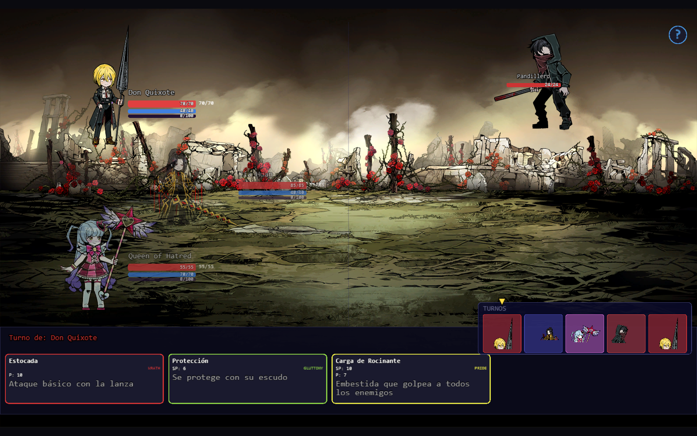

# Sendas del Destino



**Sendas del Destino** is a turn-based roguelike game set in *The City*, inspired by Project Moon's *Limbus Company*. Built with vanilla JavaScript and PixiJS 7.

Navigate branching maps, fight enemies using the 7 sins system, collect relics, and manage your party of Fixers and Abnormalities through procedurally generated runs.

> Fan project created for educational purposes.

---

## Features

- **🗺️ Branching Map Progression** — 3 zones (Backstreets, The Nest, The Great Lake) with procedural node layouts: Combat, Elite, Rest, Treasure, Event, and Boss nodes.
- **⚔️ Turn-Based Combat** — The 7 sin affinities system (Wrath, Lust, Sloth, Gloom, Gluttony, Pride, Envy). Status effects: Bleed, Shield, Weakness, Attack Up, Defense Up, Taunt, Cleanse.
- **👥 3 Unique Characters**
  - **Don Quixote** (DPS) — High attack, bleed stacking, devastating E.G.O ultimate.
  - **Jia Huan** (Tank) — Taunts enemies, shields the party, high HP pool.
  - **Queen of Hatred** (Support) — Heals, cleanses debuffs, applies party-wide buffs.
- **💎 20 Relics** — Passive items across 3 rarities (Common, Rare, Legendary) that stack across runs.
- **🌀 E.G.O System** — Ultimate skills with sin resonance and special animations, charged through combat.
- **🎵 Original Soundtrack** — CC BY 4.0 music by Scott Buckley (see Attribution).
- **🎨 Pixel Art Assets** — Character and enemy sprites sourced from the *Limbus Company* wiki (fan content).

---

## How to Play

**Prerequisites:** Node.js (any recent version).

```bash
node server.js
```

Open your browser to `http://localhost:8000`.

**Controls:**
- Click nodes on the map to advance.
- Select a character, then choose a skill from the panel.
- Target enemies by clicking them.
- Scroll the skill panel with the mouse wheel.
- Press the `?` button (top-right in battle) for help on sin affinities.

---

## Music Attribution

All music tracks are CC BY 4.0 licensed and provided by [Scott Buckley](https://www.scottbuckley.com.au/):

| Track | Album | Scene |
|---|---|---|
| [Decoherence](https://www.scottbuckley.com.au/library/decoherence/) | *Decoherence* | Exploration |
| [Legionnaire](https://www.scottbuckley.com.au/library/legionnaire/) | *Legionnaire* | Combat |
| [Rise Above](https://www.scottbuckley.com.au/library/rise-above/) | *Rise Above* | Boss |
| [Shadows and Dust](https://www.scottbuckley.com.au/library/shadows-and-dust/) | *Shadows and Dust* | Menu |

---

## Tech Stack

- **PixiJS v7.3.2** (rendering via CDN)
- **Vanilla JavaScript** (no bundlers, no npm dependencies)
- **Node.js** (dev server only)
- **HTML5 Canvas** (letterboxed 16:9 scaling)

---

## Credits

- **Project Moon** — Original *Limbus Company* universe, characters, and enemy designs.
- **Scott Buckley** — Licensed music (CC BY 4.0).
- **Limbus Company Wiki** ([limbuscompany.wiki.gg](https://limbuscompany.wiki.gg/)) — Background and sprite resources.

Built as a student project. Not affiliated with Project Moon.
